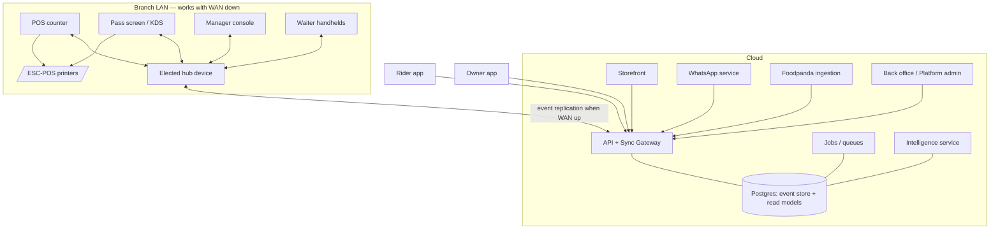

# 00 — Platform Overview & Engineering Conventions

**Module spec — Draft 1, July 2026**
Parent documents: `../restaurant-os-v2-concept.md` (vision), `../restaurant-os-spec.md` (v1 reference detail). This document is the anchor for every module spec in `specs/`: shared architecture, tech stack, cross-cutting requirements, data conventions, configuration model, and the template every module document follows. Module docs do not repeat what is stated here — they reference it.

---

## 1. Module map & document index

| # | Document | Module | Layer | Runs on | Wave |
|---|---|---|---|---|---|
| 01 | `01-kernel-sync.md` | Kernel: event ledger, sync mesh, catalog, customer file, auth/devices | Kernel | Cloud + every device | 0 |
| 02 | `02-pos-app.md` | POS / counter app (billing, orders, payments, shifts, phone-order entry) | App + driver | Windows (Electron), Android (RN) | 1 |
| 03 | `03-kitchen-fulfillment.md` | Printing service, pass screen, KDS, aging/ETA pipeline | App + driver | Android tablets, thermal printers | 1 |
| 04 | `04-waiter-app.md` | Waiter handheld (T3) | App | Android incl. BYOD | 4 |
| 05 | `05-manager-console.md` | Manager console (alarms, approvals, floor state, channel pulse, day open/close) | App | Manager's Android/iOS phone | 1 core / 4 full |
| 06 | `06-storefront.md` | Hosted storefront (QR dine-in, pickup, delivery; all own-channel doors land here) | Driver | Cloud web (Next.js) | 2 |
| 07 | `07-whatsapp-channel.md` | WhatsApp service (ordering door, notifications, support, analyst surface) | Driver | Cloud service | 2 |
| 08 | `08-foodpanda-ingestion.md` | Aggregator ingestion (manual entry mode + Delivery Hero POS API) | Driver | Cloud service (+ POS quick-entry) | 1 manual / 4 API |
| 09 | `09-rider-dispatch.md` | Rider app + dispatch + COD settlement | App | Rider Android (RN) + counter surface | 2 |
| 10 | `10-inventory-supply.md` | Inventory, recipes, purchasing, wastage, counts, variance, prep planning, forecasting | Service + UI | Cloud + back office + mobile flows | 3 |
| 11 | `11-staff-people.md` | Attendance, advances/baqaya ledger, scheduling basics, restaurant memory | Service + UI | Cloud + devices | 3 |
| 12 | `12-owner-app.md` | Owner app (live view, summaries, alerts, reports, multi-branch) | App | Android + iOS (RN) | 1 basic / 4 full |
| 13 | `13-intelligence.md` | Intelligence: semantic layer, nightly brief, anomaly alerts, conversational analyst, autonomy ladder | Service | Cloud | 4 (foundations from 1) |
| 14 | `14-backoffice.md` | Restaurant back office (catalog, devices, roles, presets, channel config) | App | Web (Next.js) | 1+, grows with modules |
| 15 | `15-platform-admin.md` | Vendor platform admin (org provisioning, onboarding tooling, fleet health, take-rate & feature flags, staged rollout) | App | Web, internal | 1+ |
| 16 | `16-tax-module.md` | FBR/PRA compliance add-on | Service | Cloud + receipt pipeline | On demand |
| 17 | `17-marketing-loyalty.md` | Broadcasts, promos, loyalty, campaign lift | App + service | Cloud + back office | 4 |
| 18 | `18-engineering-handbook.md` | Engineering standards: monorepo layout, exact libraries, per-layer rules (UI, state, data, testing, CI) | Standards | — | 0 |
| 19 | `19-sync-engine-decision.md` | Decision record: build vs buy for the sync engine (PowerSync, Electric, Zero, Turso, Ditto vs custom) | Decision | — | 0 |
| 20 | `20-testing-correctness.md` | Testing taxonomy, environments (Docker strategy), and the AI-correctness system (Auditor, mutation gates, release gates) | Standards | — | 0 |
| 21 | `21-ux-system.md` | UX system: closed component vocabulary, numeric UX budgets, per-role design laws, real-staff testing protocol | Standards | — | 0 |

Waves are the dependency order from the concept doc §8: 0 Foundation → 1 Service → 2 Commerce+Delivery → 3 Supply+People → 4 Intelligence+Scale. A module's wave is when its first production slice ships to a dev-pilot restaurant; most modules keep growing afterward.

## 2. Architecture overview



- **Kernel** (doc 01): append-only event ledger + replication protocol. Every device holds a local SQLite event log + materialized state; the cloud holds the merged org-wide log and read models. In-branch devices replicate peer-to-hub over LAN in real time; the hub (or any online device) replicates with the cloud.
- **Drivers** are order sources (storefront, WhatsApp, foodpanda, phone entry, POS itself) and hardware endpoints (printers, screens). All order sources emit the same kernel events into one queue.
- **Services** (inventory, staff, intelligence, tax) are cloud-side consumers/producers of kernel events plus their own entities.
- **Apps** are surfaces over kernel state, each with a role-scoped view.

## 3. Tech stack (decided)

| Concern | Choice | Notes |
|---|---|---|
| Language | TypeScript everywhere, `strict` | One language the whole team reviews deeply; AI-generated code, senior-reviewed |
| Monorepo | pnpm workspaces + Turborepo | Single repo for all apps/services/packages |
| Backend runtime | Node.js (current LTS) | Fastify HTTP; WebSocket for sync + realtime |
| Internal APIs | tRPC (shared types end-to-end) | REST + webhooks only where third parties require (foodpanda, WhatsApp, payments, FBR) |
| Validation/schemas | Zod, shared in `packages/domain` | Event payloads, API inputs, config schemas — one source of truth |
| Cloud DB | PostgreSQL (managed, e.g. Neon) | Append-only event table (partitioned) + per-module read models; Drizzle ORM |
| Jobs/queues | BullMQ on Redis | Nightly brief, fiscalization store-and-forward, webhook retries, forecast jobs |
| Object storage | S3-compatible | Invoice/wastage photos, exports |
| Device DB | SQLite | Electron: `better-sqlite3`; React Native: `op-sqlite`; WAL mode everywhere |
| Sync engine | Custom, pure TS, storage-adapter interface | Shared package used by every device app; see doc 01 (incl. build-vs-buy note) |
| Android fleet apps | React Native (Expo) | POS-Android, pass/KDS, waiter, rider, owner, manager |
| Windows counter | Electron + React | Node main process owns printing (USB/serial ecosystem) and the sync/LAN hub role |
| Web surfaces | Next.js | Storefront, back office, platform admin |
| Shared UI | `packages/ui` — RN-first components; web surfaces style independently | Do not force one UI kit across RN and Next.js; share tokens (colors, spacing, type scale) |
| Printing | `packages/escpos` — custom ESC/POS encoder + transports (USB, BT SPP/BLE, TCP 9100) | Printer text fonts for English/numerals; bitmap path for logos/QR; compatibility harness (doc 03) |
| Push | FCM (Android) + APNs (iOS owner/manager apps) | |
| LLM | Anthropic Claude API (TS SDK) | Model tiering decided at build time per task; all LLM use behind the semantic layer (doc 13) |
| Auth | Session tokens per device registration + per-user PIN unlock (Argon2id) | Server-side role authorization always; devices revocable (doc 01) |
| Observability | OpenTelemetry traces/metrics; Sentry for errors; custom device heartbeat | Fleet health surfaces in doc 15 |
| CI/CD | GitHub Actions; EAS builds for RN; staged rollout channels | POS never force-updates during business hours (doc 15) |

**Explicit non-choices:** no microservices (one modular Node backend, module boundaries enforced in code); no Kubernetes at this scale (containerized deploy on a managed platform); no GraphQL; no cross-platform-everything UI framework promises — RN and web share logic and tokens, not pixels.

This table is the summary; the binding detail — exact packages, monorepo layout, and per-layer rules (UI, state, data, testing, CI) — lives in `18-engineering-handbook.md`, which also seeds the repo's `CLAUDE.md`.

## 4. Repository layout & development approach

```
restos/
  apps/        pos-electron, pos-rn, pass-kds, waiter, rider, owner, manager,
               storefront, backoffice, platform-admin
  services/    api-gateway, sync-gateway, whatsapp, foodpanda, intelligence,
               tax, jobs
  packages/    domain (types, zod schemas, event defs), sync-client, escpos,
               ui, config, testing
  specs/       these documents
```

- **Spec-driven, one module at a time.** A module's document is the contract; work is broken into tasks from it; AI writes the code; a senior reviews against the spec. Spec changes are edits to the document first.
- **Vertical slice first.** The first runnable milestone is a thread through the whole architecture, not a finished module: order entered on POS → kernel event persisted locally → replicated over LAN to a second device → KOT prints → syncs to cloud when WAN returns → visible in a trivial owner view. Every module then thickens an already-working spine.
- **Testing strategy:**
  - *Durability:* automated crash/kill tests + physical plug-pull protocol on reference hardware (a confirmed order survives power loss, mid-print).
  - *Sync:* property-based tests (fast-check) on merge — random event interleavings across N simulated devices converge to identical state; offline/online partitions; clock skew.
  - *Printers:* physical test rig with the field-reality printer set (Black Copper + generic Chinese, 58/80mm, USB/BT/LAN); compatibility list maintained from it.
  - *Rush simulation:* scripted load generator replaying a realistic Friday-rush order stream against a full branch device set.
  - *Standard:* Vitest unit/integration; Playwright for web surfaces; Maestro for RN flows.
- **Environments:** local (simulated branch: multiple app instances + virtual printer) → staging cloud → dev-pilot restaurants (real service, real staff, feature-flagged) → production fleet.
- **Reference hardware set** (kept in office): PKR ~25k Android tablet (2–3GB RAM), low-end Android phone, old Windows 10 PC, the printer rig, cash drawer.

## 5. Cross-cutting requirements (every module inherits these)

1. **Offline-first:** every in-branch function works with WAN down, indefinitely; branch LAN coordination keeps working; cloud-only surfaces (storefront, owner app) degrade honestly. Cloud-originated orders queue for the branch and enter the moment connectivity returns — the storefront tells the customer the truth about confirmation state.
2. **Durability:** a confirmed transaction survives instant power loss. SQLite WAL + explicit checkpoints; no confirmed-state in memory only, ever.
3. **Performance targets** (reference hardware): order line add → UI feedback < 100 ms; confirm → KOT printing starts < 2 s; POS cold start < 6 s; LAN event propagation (device → device) < 1 s p95; sync catch-up after 8h offline with ~500 orders < 60 s on 4G; owner dashboard cached load < 2 s.
4. **Security:** TLS everywhere; per-device registration tokens, revocable; PINs Argon2id-hashed, lockout on repeated failure; server-side role authorization (never trust client role claims); org data isolation absolute (customer phone numbers never cross orgs); audit log immutable, hash-chained per device.
5. **Append-only:** no silent edit/delete of historical transactions by any role; corrections are new linked records (concept doc law 2).
6. **Language & learnability:** UI is **English only** (v1 language decision — no i18n layer, no RTL). Staff who read little navigate by memorized visual position, so the doc-21 stable-layout and icon+number laws carry the low-literacy load. Numerals everywhere they can (prices, tables, quantities); PKR with thousands separators. All staff-facing flows learnable < 15 min. String hygiene: user-facing strings live in per-app `strings.ts` catalogs (lint-banned inline) — not i18n, just a mechanical migration path if a second language is ever added.
7. **Sync honesty:** every screen showing remote data displays last-synced age; stale is never presented as live.
8. **Automation law** (concept doc law 1): every fact is a side-effect, an ingestion, or a scheduled verified ritual. Module specs must not introduce discretionary data entry.

## 6. Data conventions

- **IDs:** UUIDv7, client-generated (offline creation never collides; time-ordered for index locality).
- **Event envelope (canonical):** `{ id, org_id, branch_id, device_id, actor_user_id, lamport_seq (per device), device_created_at, server_received_at, type, schema_version, payload, refs[] }`. Server time is authoritative for reporting; device lamport sequence is authoritative for ordering a device's own events.
- **Money:** integer paisas. **Quantities:** integer milligrams / millilitres / units. No floats in ledgers, ever.
- **Soft references:** consumers tolerate out-of-order arrival (an order may sync before its shift record).
- **Event schema evolution:** additive-only payload changes under the same `schema_version`; breaking changes bump the version and ship a reader for N−1. Old events are never rewritten.
- **Naming:** event types are `noun.verb_past` (`order.created`, `order.line_state_changed`, `stock.movement_recorded`, `cash.paid_out`). The full catalog lives in doc 01 §4 and `packages/domain`.

## 7. Configuration & customizability model

Three layers, strictly ordered; lower layers cannot override higher ones:

1. **Platform admin (vendor):** org provisioning, feature flags/tier enablement, own-channel take-rate %, rollout channels.
2. **Organization (back office):** operating profile, hardware tier (T1/T2/T3), channels enabled, menu/catalog/recipes, roles & users, **signal ownership** (which role advances which order state — e.g. who marks "ready"), approval thresholds (discount %, void rules), tax posture, printer routing rules, alert thresholds.
3. **Branch/device:** language, printer assignments, station identity (this screen is "grill"), float amounts, idle-lock timeout.

**Presets, not knobs:** restaurants pick a profile + tier which sets sane defaults for everything in layer 2; individual settings are adjustable within designed bounds, but modules must not introduce free-form configuration. Every module doc's Customizability section lists exactly which settings it exposes at which layer — and states what is deliberately NOT configurable.

## 8. Module document template

Every module doc follows this structure:

```
# NN — <Module name>
**Module spec — Draft 1, July 2026** · status line, parent docs
1. Purpose & scope        — what it is, who uses it, devices, which tiers/profiles get it
2. Position in platform   — dependencies: events consumed/emitted, services required, docs referenced
3. Functional requirements — numbered (NN-F1…), grouped by flow; testable statements
4. Key flows              — the sequences that matter, step by step (happy path + failure paths)
5. Data                   — entities owned, events emitted/consumed (names from packages/domain)
6. Non-functional requirements — only module-specific ones; cross-cutting NFRs are inherited from 00 §5
7. Customizability        — settings by config layer (00 §7); what is deliberately not configurable
8. Tech notes             — stack specifics, libraries, platform constraints, build-vs-buy calls
9. Open questions         — decisions deferred to build time
```

Style: concrete and testable; no business/pricing/market content; language/offline/performance handled by reference to 00 §5 unless the module tightens them; 150–300 lines per doc.

## 9. Where building starts

Recommendation (decided module-by-module from these docs, but the dependency math is fixed): **doc 01 (kernel + sync) as a thin vertical slice**, proven by the spine in §4 — two devices, one printer, WAN-drop test, plug-pull test — then thicken with doc 02 (POS) and doc 03 (printing/pass) toward a T1/T2 restaurant running Wave 1 live.
