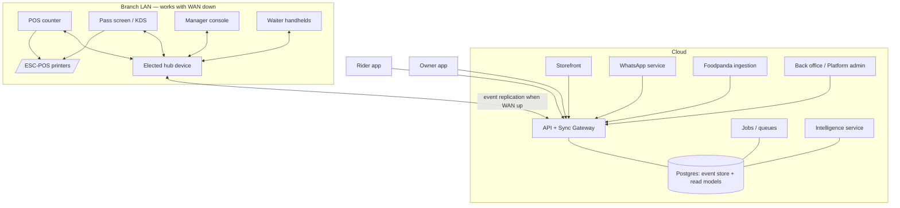

# 00 — Platform Overview & Engineering Conventions

**Module spec — Draft 1, July 2026**
Parent document: `../restaurant-os.md` (Part I: platform vision and settled product laws · Part II: product reference seeds). This document is the anchor for every module spec in `specs/`: shared architecture, tech stack, cross-cutting requirements, data conventions, configuration model, and the template every module document follows. Module docs do not repeat what is stated here — they reference it.

**Authority order (byte-identical in `restaurant-os.md` and `specs/00-platform-overview.md`; `pnpm docs:lint` enforces it):** (1) `restaurant-os.md` Part I for vision, waves, and settled product laws; (2) `specs/00` §5 + `specs/21-ux-system.md` for cross-cutting UX/offline/performance; (3) the owning module spec for its normative behavior (03 kitchen states, 09 delivery/COD, 05 approvals); (4) `restaurant-os.md` Part II appendices are seeds the specs refine — a module spec that amends its seed wins.

---

## 1. Module map & document index

| # | Document | Module | Layer | Runs on | Wave |
|---|---|---|---|---|---|
| 01 | `01-kernel-sync.md` | Kernel: event ledger, sync mesh, catalog, customer file, auth/devices | Kernel | Cloud + every device | 0 |
| 02 | `02-pos-app.md` | POS / counter app (billing, orders, payments, shifts, phone-order entry) | App + driver | Windows (Electron), Android (RN) | 1 |
| 03 | `03-kitchen-fulfillment.md` | Printing service, pass screen, KDS, aging/ETA pipeline | App + driver | Android tablets, thermal printers | 1 |
| 04 | `04-waiter-app.md` | Waiter handheld (T3) | App | Android incl. BYOD | 4 |
| 05 | `05-manager-console.md` | Manager console (alarms, approvals, floor state, channel pulse, day open/close) | App | Manager's Android/iOS phone | 1 core / 4 full |
| 06 | `06-storefront.md` | Hosted storefront (QR dine-in, pickup, delivery; all own-channel doors land here) | Driver | Cloud web (Next.js) | 2 |
| 07 | `07-whatsapp-channel.md` | WhatsApp service (ordering door, notifications, support; analyst surface in Wave 4 with doc 13) | Driver | Cloud service | 2 (analyst 4) |
| 08 | `08-foodpanda-ingestion.md` | Aggregator ingestion (manual entry mode + Delivery Hero POS API) | Driver | Cloud service (+ POS quick-entry) | 1 manual / 4 API |
| 09 | `09-rider-dispatch.md` | Rider app + dispatch + COD settlement | App | Rider Android (RN) + counter surface | 2 |
| 10 | `10-inventory-supply.md` | Inventory, recipes, purchasing, wastage, counts, variance, prep planning, forecasting | Service + UI | Cloud + back office + mobile flows | 3 |
| 11 | `11-staff-people.md` | Attendance, advances/baqaya ledger, scheduling basics, restaurant memory | Service + UI | Cloud + devices | 3 |
| 12 | `12-owner-app.md` | Owner app (live view, summaries, alerts, reports, multi-branch) | App | Android + iOS (RN) | 1 basic / 4 full |
| 13 | `13-intelligence.md` | Intelligence: semantic layer, nightly brief, anomaly alerts, conversational analyst, autonomy ladder | Service | Cloud | 4 (foundations from 1) |
| 14 | `14-backoffice.md` | Restaurant back office (catalog, devices, roles, presets, channel config) | App | Web (Next.js) | 1+, grows with modules |
| 15 | `15-platform-admin.md` | Vendor platform admin (org provisioning, onboarding tooling, fleet health, take-rate & feature flags, staged rollout) | App | Web, internal | 1+ |
| 16 | `16-tax-module.md` | FBR/PRA compliance add-on | Service | Cloud + receipt pipeline | On demand |
| 17 | `17-marketing-loyalty.md` | Broadcasts, promos, loyalty, campaign lift | App + service | Cloud + back office | 4 |
| 18 | `18-engineering-handbook.md` | Engineering standards: monorepo layout, exact libraries, per-layer rules (UI, state, data, testing, CI) | Standards | — | 0 |
| 19 | `19-sync-engine-decision.md` | Decision record: build vs buy for the sync engine (PowerSync, Electric, Zero, Turso, Ditto vs custom) | Decision | — | 0 |
| 20 | `20-testing-correctness.md` | Testing taxonomy, environments (Docker strategy), and the AI-correctness system (Auditor, mutation gates, release gates) | Standards | — | 0 |
| 21 | `21-ux-system.md` | UX system: closed component vocabulary, numeric UX budgets, per-role design laws, real-staff testing protocol | Standards | — | 0 |
| 22 | `22-operations-recovery.md` | Backup/DR (RPO/RTO, restore drills via the Auditor), data residency, retention/erasure, org export, vendor exit | Standards | Cloud | Pre-pilot |
| 23 | `23-ai-context.md` | AI context engineering: the AGENTS.md router, tiered loading, enforcement map, hooks/skills/rules scaffolding | Standards | — | 0 |
| 24 | `24-development-harness.md` | Development harness: task contract, DoD ladder, conformance matrices, loop protocol, test-authorship law, drift rails | Standards | — | 0 |
| 25 | `25-fold-performance.md` | Decision record: incremental fold maintenance under retroactive reordering — the measured O(N²) re-fold, the research verdict, and the refuted proposals (live design: 26) | Decision | Device | 0 |
| 26 | `26-merge-semantics.md` | Design record: per-fold merge algebra — how folds converge without a universal total order; projection-key sidecar, `global_seq` as delivery cursor | Design | Device | 0 |
| 27 | `27-design-language.md` | Engineering standards: the visual layer of doc 21 — layout depth law, touch minimums by posture, colour/type/numeral/icon systems, token architecture. Evidence-derived; every number traces to `plans/wave-1/research/` | Standards | All | 1 |
| 28 | `28-tenancy.md` | Tenancy & entitlement: what an org is as a tenant, its lifecycle, entitlement as a second orthogonal gate, suspension/closure, self-serve signup, vendor identity, isolation at the serving layer (billing deferred — shape only) | Standards | Cloud | 1+ |
| — | `DECISIONS.md` | Cross-cutting decision register: proposed/accepted platform decisions not yet owned by a single doc | Register | — | — |

Waves are the dependency order from the concept doc §8: 0 Foundation → 1 Service → 2 Commerce+Delivery → 3 Supply+People → 4 Intelligence+Scale. A module's wave is when its first production slice ships to a dev-pilot restaurant; most modules keep growing afterward.

## 2. Architecture overview


```mermaid
flowchart TB
  subgraph CLOUD[Cloud]
    API[API + Sync Gateway]
    ES[(Postgres: event store + read models)]
    Q[Jobs / queues]
    INT[Intelligence service]
    SF[Storefront]
    WA[WhatsApp service]
    FP[Foodpanda ingestion]
    BO[Back office / Platform admin]
    API --- ES
    Q --- ES
    INT --- ES
    SF --> API
    WA --> API
    FP --> API
    BO --> API
  end
  subgraph BRANCH[Branch LAN — works with WAN down]
    HUB[Elected hub device]
    POS[POS counter]
    PASS[Pass screen / KDS]
    MGR[Manager console]
    WTR[Waiter handhelds]
    PRN[/ESC-POS printers/]
    POS <--> HUB
    PASS <--> HUB
    MGR <--> HUB
    WTR <--> HUB
    POS --> PRN
    PASS --> PRN
  end
  HUB <-->|event replication when WAN up| API
  RIDER[Rider app] --> API
  OWNER[Owner app] --> API
```

- **Kernel** (doc 01): append-only event ledger + replication protocol. Every device holds a local SQLite event log + materialized state; the cloud holds the merged org-wide log and read models. In-branch devices replicate peer-to-hub over LAN in real time; the hub (or any online device) replicates with the cloud.
- **Drivers** are order sources (storefront, WhatsApp, foodpanda, phone entry, POS itself) and hardware endpoints (printers, screens). All order sources emit the same kernel events into one queue.
- **Services** (inventory, staff, intelligence, tax) are cloud-side consumers/producers of kernel events plus their own entities.
- **Apps** are surfaces over kernel state, each with a role-scoped view.

## 3. Tech stack (decided)

| Concern | Choice | Notes |
|---|---|---|
| Language | TypeScript everywhere, `strict` | One language the whole team reviews deeply; AI-generated code, reviewed per `20 §4.4` |
| Monorepo | pnpm workspaces + Turborepo | Single repo for all apps/services/packages |
| Backend runtime | Node.js (current LTS) | Fastify HTTP; WebSocket for sync + realtime |
| Internal APIs | tRPC (shared types end-to-end) | REST + webhooks only where third parties require (foodpanda, WhatsApp, payments, FBR) |
| Validation/schemas | Zod, shared in `packages/domain` | Event payloads, API inputs, config schemas — one source of truth |
| Cloud DB | PostgreSQL (managed, e.g. Neon) | Append-only event table (partitioned) + per-module read models; Drizzle ORM |
| Jobs/queues | BullMQ on Redis | Nightly brief, fiscalization store-and-forward, webhook retries, forecast jobs |
| Object storage | S3-compatible | Invoice/wastage photos, exports |
| Device DB | SQLite | Electron: `better-sqlite3`; React Native: `op-sqlite`; WAL mode everywhere |
| Sync engine | Custom, pure TS, storage-adapter interface | Shared package used by every device app; see doc 01 (incl. build-vs-buy note) |
| Android fleet apps | React Native (Expo) | POS-Android, pass/KDS, waiter, rider, owner, manager |
| Windows counter | Electron + React | Node main process owns printing (USB/serial ecosystem) and the sync/LAN hub role |
| Web surfaces | Next.js | Storefront, back office, platform admin |
| Shared UI | `packages/ui` — RN-first components; web surfaces style independently | Do not force one UI kit across RN and Next.js; share tokens (colors, spacing, type scale) |
| Printing | `packages/escpos` — custom ESC/POS encoder + transports (USB, BT SPP/BLE, TCP 9100) | Printer text fonts for English/numerals; bitmap path for logos/QR; compatibility harness (doc 03) |
| Push | FCM (Android) + APNs (iOS owner/manager apps) | |
| LLM | Anthropic Claude API (TS SDK) | Model tiering decided at build time per task; all LLM use behind the semantic layer (doc 13) |
| Auth | Session tokens per device registration + per-user PIN unlock (Argon2id) | Server-side role authorization always; devices revocable (doc 01) |
| Observability | OpenTelemetry traces/metrics; Sentry for errors; custom device heartbeat | Fleet health surfaces in doc 15 |
| CI/CD | GitHub Actions; EAS builds for RN; staged rollout channels | POS never force-updates during business hours (doc 15) |

**Explicit non-choices:** no microservices (one modular Node backend, module boundaries enforced in code); no Kubernetes at this scale (containerized deploy on a managed platform); no GraphQL; no cross-platform-everything UI framework promises — RN and web share logic and tokens, not pixels.

This table is the summary; the binding detail — exact packages, monorepo layout, and per-layer rules (UI, state, data, testing, CI) — lives in `18-engineering-handbook.md`, which also seeds the repo's `CLAUDE.md`.

## 4. Repository layout & development approach

```
restos/
  apps/        pos-electron, pos-rn, pass-kds, waiter, rider, owner, manager,
               storefront, backoffice, platform-admin
  services/    api-gateway, sync-gateway, whatsapp, foodpanda, intelligence,
               tax, jobs
  packages/    domain (types, zod schemas, event defs), sync-client, escpos,
               ui, config, testing
  specs/       these documents
```

- **Spec-driven, one module at a time.** A module's document is the contract; work is broken into tasks from it; AI writes the code; `20 §4.4`'s review lane reads it against the spec. Spec changes are edits to the document first.
- **Vertical slice first.** The first runnable milestone is a thread through the whole architecture, not a finished module: order entered on POS → kernel event persisted locally → replicated over LAN to a second device → KOT prints → syncs to cloud when WAN returns → visible in a trivial owner view. Every module then thickens an already-working spine.
- **Testing strategy:**
  - *Durability:* automated crash/kill tests + physical plug-pull protocol on reference hardware (a confirmed order survives power loss, mid-print).
  - *Sync:* property-based tests (fast-check) on merge — random event interleavings across N simulated devices converge to identical state; offline/online partitions; clock skew.
  - *Printers:* physical test rig with the field-reality printer set (Black Copper + generic Chinese, 58/80mm, USB/BT/LAN); compatibility list maintained from it.
  - *Rush simulation:* scripted load generator replaying a realistic Friday-rush order stream against a full branch device set.
  - *Standard:* Vitest unit/integration; Playwright for web surfaces; Maestro for RN flows.
- **Environments:** local (simulated branch: multiple app instances + virtual printer) → staging cloud → dev-pilot restaurants (real service, real staff, feature-flagged) → production fleet.
- **Reference hardware set** (kept in office): PKR ~25k Android tablet (2–3GB RAM), low-end Android phone, old Windows 10 PC, the printer rig, cash drawer.

## 5. Cross-cutting requirements (every module inherits these)

1. **Offline-first:** every in-branch function works with WAN down, indefinitely; branch LAN coordination keeps working; cloud-only surfaces (storefront, owner app) degrade honestly. Cloud-originated orders queue for the branch and enter the moment connectivity returns — the storefront tells the customer the truth about confirmation state.
2. **Durability:** a confirmed transaction survives instant power loss. SQLite WAL + explicit checkpoints; no confirmed-state in memory only, ever.
3. **Performance targets** (reference hardware): order line add → UI feedback < 100 ms; confirm → KOT printing starts < 2 s; POS cold start < 6 s; LAN event propagation (device → device) < 1 s p95; sync catch-up after 8h offline with ~500 orders < 60 s on 4G; owner dashboard cached load < 2 s.
4. **Security:** TLS everywhere; per-device registration tokens, revocable; PINs Argon2id-hashed, lockout on repeated failure; server-side role authorization (never trust client role claims); org data isolation absolute (customer phone numbers never cross orgs); audit log immutable, hash-chained per device.
5. **Append-only:** no silent edit/delete of historical transactions by any role; corrections are new linked records (concept doc law 2).
6. **Language & learnability:** UI is **English only** (launch decision — no i18n layer, no RTL). Staff who read little navigate by memorized visual position, so the doc-21 stable-layout and icon+number laws carry the low-literacy load. Numerals everywhere they can (prices, tables, quantities); PKR with thousands separators. All staff-facing flows learnable < 15 min. String hygiene: user-facing strings live in per-app `strings.ts` catalogs (lint-banned inline) — not i18n, just a mechanical migration path if a second language is ever added. **Sole exception — customer conversational surfaces (WhatsApp/social DM):** input understanding is multilingual by nature (English, roman-Urdu, voice notes — 07-F22/F24); replies are English at launch, and bilingual roman-Urdu replies are a later, eval-gated stage (07-F23). Staff and owner UI have no exception. **Interface language ≠ user content:** customer-entered data (names, addresses, notes, messages, transcripts) is uncontrolled Unicode and may contain Urdu script — every surface renders it faithfully (system fonts, bidi-safe, truncation-safe), and printing falls back to bitmap rasterization for non-Latin content fields (03-F8). User content is never transliterated or rejected for its script.
7. **Sync honesty:** every screen showing remote data displays last-synced age; stale is never presented as live.
8. **Automation law** (concept doc law 1): every fact is a side-effect, an ingestion, or a scheduled verified ritual. Module specs must not introduce discretionary data entry.

## 6. Data conventions

- **IDs:** UUIDv7, client-generated (offline creation never collides; time-ordered for index locality).
- **Event envelope (canonical):** `{ id, org_id, branch_id, device_id, actor_user_id, lamport_seq (per device), device_created_at, server_received_at, type, schema_version, payload, refs[] }`. Server time is authoritative for reporting; device lamport sequence is authoritative for ordering a device's own events.
- **Money:** integer paisas. **Quantities:** integer milligrams / millilitres / units. No floats in ledgers, ever. JS has no integer type, so "integer paisas" means integers held in a double — addition/subtraction are exact, and the danger is **division and rates**. Therefore: percentages and tax rates are expressed as integer **basis points** (1700 = 17%), never a float literal; and any operation that divides money (split bills, rate application, apportionment) goes through a `domain` helper with an explicit stated rounding policy whose parts provably sum back to the original total. No module may divide or scale money inline (DEC-MONEY-005).
- **Soft references:** consumers tolerate out-of-order arrival (an order may sync before its shift record).
- **Event schema evolution:** additive-only payload changes under the same `schema_version`; breaking changes bump the version and ship a reader for N−1. Old events are never rewritten.
- **Naming:** event types are `noun.verb_past` (`order.created`, `order.line_state_changed`, `stock.movement_recorded`, `cash.paid_out`). The full catalog lives in doc 01 §4 and `packages/domain`.

## 7. Configuration & customizability model

Three layers, strictly ordered; lower layers cannot override higher ones:

1. **Platform admin (vendor):** org provisioning, feature flags/tier enablement, own-channel take-rate %, rollout channels.
2. **Organization (back office):** operating profile, hardware tier (T1/T2/T3), channels enabled, menu/catalog/recipes, roles & users, **signal ownership** (which role advances which order state — e.g. who marks "ready"), approval thresholds (discount %, void rules), tax posture, printer routing rules, **station fulfilment routes** (`paper | screen | both` per kitchen station — 03-F22/03-F51; a station routed `screen` never spools, so the absence of a printer is a configuration and not a fault, and a station with no route at all is refused when it is configured), alert thresholds, **business-day cutover hour** (default 05:00; the Asia/Karachi anchor itself is platform law, not a setting — 01-F46). **Amended August 2026 by founder rulings R55, R60 and R63** (`plans/saas-pivot/plan-of-record.md` §0 — three rulings that are one sentence, *"the owner sets it"*): the **tender set**, the ways money is taken, as a seed the owner enables, disables and extends, each row carrying a **tax rate in integer basis points** (R55 — ⚠ a *tender* is not 02-F42's order `channel`; see (f)); a **commission rate per card provider**, per (org, provider) because it is negotiated vendor by vendor (R60), and informational only — the bank's settlement is the truth, so no computed net may be presented as reconciled; and the **paid-out approval threshold** (05-F19) beside the discount % already listed (R63).
3. **Branch/device:** printer assignments, station identity (this screen is "grill"), float amounts, idle-lock timeout, **panel pixel density** (`panel_ppi`; 27-F68 makes a dp a *physical* size, so the renderer needs the density of the glass in front of the operator. It is a **measurement first**: the runtime reads the display's resolution and physical size from the OS, and this key exists only to correct a panel that reports nothing or reports wrong. A number a technician types is a number a technician mistypes, and the failure is silent — every touch target renders at the wrong physical size and nothing on screen looks broken).

**Presets, not knobs — and what that means once the value is genuinely the org's.** Restaurants pick a profile + tier which sets sane defaults for everything in layer 2; individual settings are adjustable within designed bounds, and modules must not introduce free-form configuration. R55/R60/R63 do not weaken this, because **it is a rule about the SHAPE of a setting and never about who supplies its VALUE.** A tax rate is not a preset and cannot be made one: any bound a vendor designs around a provincial notification is the vendor deciding what tax is legal, which is what R55 overruled 16-F4 for. The vendor designs the *schema* — which settings exist, their type, unit, key space and refusals; the org supplies the *value*, and, where the corpus declares a registry, the *rows*. Every module doc's Customizability section lists exactly which settings it exposes at which layer — and states what is deliberately NOT configurable.

**(a) The line: the INSTRUMENT is fixed, the BUSINESS is configurable (R50).** Position, order, density and hue are not merchant settings (27-F4, 27-F7, 27-F72, 27-F74); the menu, its prices, the tenders, their tax rates and the thresholds are the owner's. **The discriminator is a *reading* of R50 rather than a transcription of it, stated so it can be disputed by FR id:** *is the value information the org holds that the vendor structurally cannot?* A negotiated bank commission, a provincial tax notification and an owner's tolerance for an unapproved discount are facts only she has. Tile size and sort order are not facts she has — they are measured properties of hands and eyes that the vendor did measure, and a preference there is taste. ⚠ **Both misreadings are one sentence away and each is expensive:** read R50 as *nothing is configurable* and no restaurant can charge its own tax; read R63 as *everything is* and the product grows a settings screen per control, which is the conditioning-stability failure 27-F4 exists to prevent.

**(b) The admission test for a new layer-2 setting — all three, or it is not one.** (i) **The shape is the corpus's.** What varies is a value, or a row in a declared registry whose columns the corpus fixed. A setting that lets an org invent an *axis*, a workflow, an order state or an event is still refused — that is what "no free-form configuration" has always meant, and R55 does not touch it: adding a tender adds a row, never a column. (ii) **The value is information the vendor cannot have.** If the vendor could know it, it is a preset and belongs in layer 1's profile + tier. This is the question that keeps the plane from becoming a knob farm, and the only one that scales — *is it useful?* always answers yes. (iii) **It declares a default that is safe to be wrong about** — (d).

**(c) What layer 2 does NOT hold.** The instrument, per (a). Anything layer 1 owns — an org cannot widen its own entitlement, feature flags or take-rate (14-F20 already makes the take-rate read-only here). The permission matrix's cells and Appendix A's seed (01-F26): layer 2 sets the *thresholds* a pair of cells is split around, never the cells. The Asia/Karachi anchor (01-F46). Money arithmetic — a *rate* is configurable, 00 §6's division and rounding discipline is not. And **the shape of an event payload**: a layer-2 value may change a value or a registry's membership, never the key set of a payload schema or of a fold's output. ⚠ **R55 lands exactly on that line, stated here rather than discovered:** `packages/domain`'s `PAYMENT_METHODS` is closed at five and 02-F23's `expected_paisa_by_method` is a `z.strictObject` **derived** from it, so an owner-extended tender set makes a cash-reconciliation fold's output shape org-dependent inside an append-only ledger. Naming that is this section's job; resolving it is owed to doc 01, doc 02 and `packages/domain` — a protected path (commandments 9 and 10).

**(d) Every layer-2 key declares a default, and the default is the end that is safe to be wrong about.** A key with no default may not be added: the alternative is a device that cannot act until the WAN has been up once, which is 00 §5.1, and 01-F17 for a sale specifically. The default is never a guess at what the org meant. For a permission-shaped threshold it is the **strict** end (approval required); for a rate it is **off** — 16-F1's *"tax is off by default"* is the corpus's own precedent and generalises; for an informational rate (R60's commission) it is **absent**, which under R60 costs a report row and no money. ⚠ **A strict default is not a stopped till, and conflating the two protections is how this rule gets weakened:** 01-F17 protects the **sale**, and a paid-out, a discount and a comp are not sales. A cashier who needs a manager PIN for petty cash at 06:00 is inconvenienced; a cashier who cannot ring an order is a stopped restaurant.

**(e) A device must be able to say which value it is using.** The resolved **source** travels with the value — `configured` (the org's arrived) or `default` (it never has) — and any surface whose behaviour would differ under the org's real value must be able to name which it holds. 00 §5.7 bans presenting stale as live; a value that never arrived is the sharper case, because there is no age to show. The minimum is that the device's health surface names every key still on its default, so an operator can tell *the owner set this* from *the owner never has* (the honesty strip that already carries `CatalogHealth` and `PanelHealth` is where that lands on a till). This is a pattern already shipping rather than an invention: `apps/pos-electron/src/main/hardware-tier.ts` resolves `derived | configured | assumed` and states the source at boot, on the argument that a wrong tier looks exactly like a right one from the screen.

**(f) The plane does not exist yet — its before-state, measured August 2026, so the migration is a change and not a discovery.** ⚠ **R63's force is this paragraph, not the threshold.**

- **`config.changed` has no payload schema.** The type is in 01 §4's catalog and org-scoped under 01-F62, and `packages/domain`'s registry carries no schema for it, so 01-F4 makes emitting one a runtime error: **a layer-2 change is today unauditable, not merely unbuilt** — and 16-F1 and 16-F4 both record a posture or rule-pack change as exactly this event. Owed to doc 01.
- **There is no path to a device.** 01-F75's reference-data resource set is **closed** — `catalog`, `staff`, `device_roster` (01-F81) — and configuration is not a member. Whether a fourth member is the answer, or whether layer-2 values ride an existing artifact, is doc 01's call and is owed there; this section states only that no path exists today.
- **There is no permission action to gate the write.** The matrix carries **27** actions (comment-blind count, August 2026) and none is about configuration, while `services/api` refuses at boot to host an ungated procedure — so the back-office write **cannot be built or booted**. That is the shape 14-F30, 14-F39 and 02-F46 each closed with an FR-decided action; this one is owed to doc 14. ⚠ R63's words are *"the owner or ops lead"* and `ROLES` is `cashier · branch_manager · storekeeper · owner`: **there is no ops lead**, and inventing one here would answer doc 14 §9's open question about a manager's back-office slice by accident. Not decided here.
- **So every layer-2 value a device needs is pinned in code or read from the environment.** `PAID_OUT_APPROVAL_THRESHOLD_PAISA = 200_000` — **Rs 2,000**, `apps/pos-electron/src/main/authorize.ts:161`, *pinned and specified nowhere in this corpus*; `canPayOut` already takes `threshold_paisa` as a **required** parameter citing this section, so the seam is right and the value has no source. Beside it, **seven layer-2 settings ride eight environment keys** (tests excluded): the enabled `(branch, channel)` set (`ENABLED_BRANCHES` / `ENABLED_CHANNELS`, 01-F60), hardware tier (`RESTOS_HARDWARE_TIER`), station fulfilment routes (`RESTOS_STATION_ROUTES`, 03-F51), aging thresholds (`RESTOS_AGING_THRESHOLDS`), kitchen quick-tags (`RESTOS_QUICK_TAGS`), and the ready- and serve-signal owners (`RESTOS_READY_SIGNAL_OWNER` / `RESTOS_SERVE_SIGNAL_OWNER`, 03-F52, 14-F17).
- **Requirement: the environment is a layer-3-and-below transport.** No layer-1 or layer-2 setting may be read from the process environment in shipping code once the plane exists; until it does, such a read is a **named stopgap** and the code must say which setting it stands in for. The eight keys above are that list, and they are the before-state a rail asserts against.
- ⚠ **What R63 does NOT close.** Whether Rs 2,000 becomes the declared **default**: it is today's value and carrying it forward is the obvious choice, but it was never chosen against a stated criterion, and (d) argues an approval threshold's default *downward*. Doc 05 owns 05-F19 and must take that decision rather than inherit it. Nor does R63 unblock the discount half on its own — `apps/pos-electron/src/main/authorize.ts` records `discount.recorded` as deliberately **fail-closed**, because the matrix carries both cells — order.discount_within_threshold and order.discount_above_threshold, named here without code quoting because they are permission **actions** and `docs-lint`'s C6 register of non-events does not yet carry them — and there is *"no threshold in `00 §7` layer 2 to feed one"*; the missing predicate is owed to `packages/domain` beside the setting, and R57's discount corrective cannot land until both exist.
- ⚠ **And "channel" now means two things in this section, which is the misreading with a money cost.** R55's **tender** — 02-F12 and 01-F32's `payment.recorded` method — is the way money is taken, and is what the owner extends. 02-F42's **order channel** (`counter · phone · storefront · whatsapp · foodpanda`) is a **price key** (01-F60) and stays closed for the reason that FR gives: an open price key is a wrong price frozen by 01-F1. 16-F2's posture matrix is channel × payment method and needs both axes distinct. The amendments R55 owes to doc 02 and doc 16 are **not taken here** — this section fixes only which axis the setting sits on.

## 8. Module document template

Every module doc follows this structure:

```
# NN — <Module name>
**Module spec — Draft 1, July 2026** · status line, parent docs
1. Purpose & scope        — what it is, who uses it, devices, which tiers/profiles get it
2. Position in platform   — dependencies: events consumed/emitted, services required, docs referenced
3. Functional requirements — numbered (NN-F1…), grouped by flow; testable statements
4. Key flows              — the sequences that matter, step by step (happy path + failure paths)
5. Data                   — entities owned, events emitted/consumed (names from packages/domain)
6. Non-functional requirements — only module-specific ones; cross-cutting NFRs are inherited from 00 §5
7. Customizability        — settings by config layer (00 §7); what is deliberately not configurable
8. Tech notes             — stack specifics, libraries, platform constraints, build-vs-buy calls
9. Open questions         — decisions deferred to build time
```

Style: concrete and testable; no business/pricing/market content; language/offline/performance handled by reference to 00 §5 unless the module tightens them; 150–300 lines per doc.

## 9. Where building starts

Recommendation (decided module-by-module from these docs, but the dependency math is fixed): **doc 01 (kernel + sync) as a thin vertical slice**, proven by the spine in §4 — two devices, one printer, WAN-drop test, plug-pull test — then thicken with doc 02 (POS) and doc 03 (printing/pass) toward a T1/T2 restaurant running Wave 1 live.
